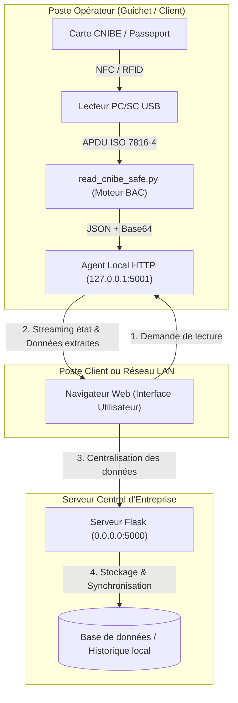

# CNIBE & Passport Reader — Système Moderne de Lecture Biométrique (eMRTD)

<p align="center">
  
  
  
  
</p>

<p align="center">
  <strong>Solution logicielle complète, modulaire et hautement sécurisée pour la lecture sans contact (NFC) des Cartes Nationales d'Identité Biométriques Électroniques (CNIBE, TD1) et Passeports Biométriques (TD3).</strong>
</p>

<p align="center">
  <a href="README.md"><strong>Français</strong></a> •
  <a href="README_EN.md"><strong>English</strong></a>
</p>

---

## 📌 Sommaire

- [Vue d'ensemble](#-vue-densemble)
- [Architecture Technique](#-architecture-technique)
- [Normes & Données Décodées](#-normes--données-décodées)
- [Matériel & Compatibilité](#-matériel--compatibilité)
- [Structure du Répertoire](#-structure-du-répertoire)
- [Guide d'Installation & Démarrage](#-guide-dinstallation--démarrage)
  - [1. Mode Ligne de Commande (CLI Standalone)](#1-mode-ligne-de-commande-cli-standalone)
  - [2. Mode Client / Serveur (Web Dashboard)](#2-mode-client--serveur-web-dashboard)
- [Spécification des API REST](#-spécification-des-api-rest)
- [Sécurité & Confidentialité](#-sécurité--confidentialité)
- [Avertissement Légal & Réglementation](#-avertissement-légal--réglementation)
- [Cas d'Usage en Entreprise](#-cas-dusage-en-entreprise)
- [Dépannage & FAQ](#-dépannage--faq)
- [Auteur & Contact](#-auteur--contact)

---

## 📖 Vue d'ensemble

Les documents de voyage et titres d'identité biométriques électroniques modernes (**eMRTD** - *electronic Machine Readable Travel Documents*) intègrent une puce RFID/NFC sécurisée contenant les données civiles et biométriques du porteur.

Historiquement, l'accès à ces informations (notamment pour la **CNIBE algérienne**) imposait l'utilisation de navigateurs et composants obsolètes (ex. Firefox 52 ESR, contrôles ActiveX Internet Explorer), rendant l'intégration difficile dans les écosystèmes informatiques modernes.

**CNIBE & Passport Reader** modernise complètement cette approche en offrant :
- Un **moteur natif Python PC/SC** implémentant le protocole de chiffrement **BAC** (*Basic Access Control*) et le déchiffrement ASN.1.
- Une **architecture découplée Client / Serveur** permettant à plusieurs postes d'opérateurs équipés de lecteurs NFC USB de remonter les informations lues vers un serveur d'entreprise centralisé.
- Une **interface web responsive moderne** (HTML5, CSS Vanilla, JavaScript asynchrone) affichant instantanément les données civiles, le NIN, la photo biométrique et la signature.
- Une **passerelle locale sécurisée** avec streaming d'état en temps réel.

---

## 🏗 Architecture Technique

Le projet repose sur une topologie réseau client-serveur conçue pour les réseaux locaux d'entreprise (LAN) :



### Avantages de cette architecture :
1. **Zéro pilote propriétaire requis côté serveur** : Le serveur Flask peut tourner sous Linux, Docker ou Windows Server sans lecteur NFC physique.
2. **Postes opérateurs légers** : Seul l'agent local et le lecteur USB sont déployés sur les ordinateurs des guichets.
3. **Isolation et résilience** : L'interruption de la communication NFC sur un poste n'affecte ni les autres postes ni le serveur central.

---

## 🔐 Normes & Données Décodées

Le moteur implémente scrupuleusement les spécifications internationales **ICAO Doc 9303 (Part 1, 3, 9, 10, 11)** :

| Data Group (DG) | Nom Standard ICAO | Contenu extrait | Décodage & Formats |
|:---|:---|:---|:---|
| **EF.DG1** | Machine Readable Zone (MRZ) | Nom, Prénoms, N° Document, Nationalité, Sexe, Dates (Naissance, Expiration) | Formats TD1 (3 lignes, CNIBE) et TD3 (2 lignes, Passeport) |
| **EF.DG2** | Biometric Facial Image | Photographie d'identité officielle en haute résolution | Extraction Tag ASN.1 `5F2E` / `7F60` (JPEG standard ou JPEG2000) |
| **EF.DG7** | Biometric Signature | Signature manuscrite numérisée du titulaire | Extraction Tag ASN.1 `5F43` (image matricielle / JPEG) |
| **EF.DG11** | Additional Personal Details | **NIN (18 chiffres)**, Nom/Prénoms en Arabe et Latin, Lieu de naissance, Sexe & Groupe Sanguin | Décodage UTF-8 et ISO/IEC 8859 avec gestion bilingue (Arabe / Français) |
| **EF.DG12** | Additional Document Details | Autorité de délivrance, Date d'émission du titre | Parsing ASN.1 textuel bilingue |
| **EF.COM** | Common Data | Liste des fichiers et Data Groups actifs sur la puce | Inventaire TLV standardisé |

### Mécanisme Cryptographique (BAC)
1. **Dérivation des clés de session** : Hachage SHA-1 du numéro de document, de la date de naissance et de la date d'expiration (avec leurs clés de contrôle respectives) pour générer `K_seed`.
2. **Calcul 3DES** : Dérivation des clés de session de chiffrement (`K_enc`) et d'authentification de message (`K_mac`).
3. **Secure Messaging** : Toutes les commandes APDU transmises pour lire les DG sont chiffrées (3DES-CBC) avec calcul d'intégrité Retail-MAC (ISO 9797-1 Mac Algorithm 3).

---

## 🧰 Matériel & Compatibilité

Le logiciel utilise l'interface standard **PC/SC** (Personal Computer/Smart Card) via le sous-système Windows Smart Card (`SCardSvr`) et la bibliothèque `pyscard`.

### Lecteurs NFC testés avec succès :
- **ACS ACR122U** (USB Contactless Smart Card Reader)
- **Identiv uTrust 3700 F** / **4701 F**
- **HID OMNIKEY 5022** / **5422**
- Tout lecteur conforme à la norme **PC/SC CCID Contactless**.

### Titres compatibles :
- **CNIBE Algérienne** (Carte Nationale d'Identité Biométrique Électronique, format TD1, puce sans contact).
- **Passeport Biométrique Algérien** (et tout passeport conforme ICAO Doc 9303, format TD3).

---

## 📁 Structure du Répertoire

```text
CNIBE-Reader/
├── LICENSE                             # Licence Open Source MIT
├── README.md                           # Documentation complète (Français)
├── README_EN.md                        # Complete Documentation (English)
│
├── local/                              # POSTE OPÉRATEUR (Client guichet)
│   ├── cnibe_agent.py                  # Passerelle HTTP locale (écoute sur 127.0.0.1:5001)
│   ├── read_cnibe_safe.py              # Moteur cryptographique PC/SC ICAO BAC autonome
│   ├── get_card_token.ps1              # Script PowerShell d'interface inter-processus
│   ├── tokens_cache.example.json       # Gabarit de cache pour diagnostics locaux
│   ├── requirements.txt                # Dépendances client (pyscard, pycryptodome)
│   ├── lancer_agent.bat                # Lanceur 1-clic pour poste opérateur
│   └── README_CLIENT.md                # Guide de configuration opérateur
│
├── serveur/                            # SERVEUR WEB CENTRAL
│   ├── server_minimal.py               # Serveur web central Flask (écoute sur 0.0.0.0:5000)
│   ├── templates/index.html            # Dashboard web moderne (visualisation, photo, historique)
│   ├── requirements.txt                # Dépendances serveur (Flask, requests)
│   ├── lancer_serveur.bat              # Lanceur 1-clic pour le serveur
│   └── README_SERVEUR.md               # Guide d'administration serveur
│
├── .dev/                               # OUTILS POUR DÉVELOPPEURS & TESTS
│   ├── inspect_endpoints.py            # Audit et test des points de terminaison
│   ├── inspect_live_ministere.py       # Script d'analyse (valeurs génériques)
│   ├── uid.py                          # Diagnostic rapide de détection NFC / ATR
│   └── README.md                       # Guide des outils de diagnostic
│
└── .gitignore                          # Protection absolue des données et caches
```

---

## 🚀 Guide d'Installation & Démarrage

### Prérequis Système
- **Système d'exploitation :** Windows 10 ou Windows 11 (64-bit).
- **Environnement :** Python 3.10 ou 3.11 installé avec `pip` et ajouté au PATH.
- **Service Windows :** Le service *Carte à puce* (`SCardSvr`) doit être en cours d'exécution.

---

### 1. Mode Ligne de Commande (CLI Standalone)

Pour les développeurs souhaitant tester directement le moteur NFC ou l'intégrer dans un script d'automatisation :

```powershell
# Déplacement dans le module local
cd local

# Installation des dépendances
py -3.11 -m pip install -r requirements.txt

# 1. Vérification des vecteurs de test mathématiques officiels ICAO
py -3.11 read_cnibe_safe.py --test-vectors

# 2. Lecture réelle d'une carte (avec numéro, date de naissance, date d'expiration)
py -3.11 read_cnibe_safe.py --doc "123456789" --dob "15/05/1985" --doe "20/12/2030" --photo "photo.jpg" --signature "signature.png"
```

---

### 2. Mode Client / Serveur (Web Dashboard)

Ce mode est idéal pour un déploiement en guichet ou en entreprise.

#### Étape A : Lancer le Serveur Central
Sur la machine faisant office de serveur (ou sur le même PC en local) :
```powershell
cd serveur
py -3.11 -m pip install -r requirements.txt
# Exécution du serveur
py -3.11 server_minimal.py
# Ou double-clic sur 'lancer_serveur.bat'
```
*Le serveur démarre et écoute sur `http://0.0.0.0:5000`.*

#### Étape B : Lancer l'Agent Client sur le poste opérateur
Sur le poste où le lecteur NFC USB est branché :
```powershell
cd local
py -3.11 -m pip install -r requirements.txt
# Exécution de l'agent
py -3.11 cnibe_agent.py
# Ou double-clic sur 'lancer_agent.bat'
```
*L'agent local écoute sur `http://127.0.0.1:5001`.*

#### Étape C : Utilisation via le Navigateur
1. Ouvrez votre navigateur et accédez à `http://127.0.0.1:5000` (ou l'adresse IP du serveur sur le réseau, ex: `http://192.168.1.100:5000`).
2. Déposez la carte CNIBE ou le passeport sur le lecteur NFC.
3. Renseignez les informations de MRZ (ou utilisez la fonction de pré-remplissage) et cliquez sur **Lire la Carte (NFC)**.
4. Les données décodées (identité, NIN, photo, signature, adresse) s'affichent instantanément à l'écran et s'enregistrent dans l'historique serveur.

---

## 📡 Spécification des API REST

### Agent Local (`http://127.0.0.1:5001`)

- **`GET /status`**
  - Vérifie la disponibilité de l'agent et la présence d'un lecteur NFC.
  - *Réponse :* `{"status": "ONLINE", "reader_connected": true, "version": "1.0.0"}`

- **`POST /scan`**
  - Déclenche l'authentification BAC et l'extraction des Data Groups.
  - *Body (JSON) :*
    ```json
    {
      "doc": "123456789",
      "dob": "15/05/1985",
      "doe": "20/12/2030",
      "wait": 15
    }
    ```
  - *Réponse :* Données civiles complètes, photo et signature encodées en Base64.

---

### Serveur Central (`http://0.0.0.0:5000`)

- **`GET /api/history`**
  - Récupère la liste des dernières lectures effectuées sur les guichets.
- **`POST /api/save_card`**
  - Enregistre une lecture pour centralisation et archivage.

---

## 🔒 Sécurité & Confidentialité

La sécurité et la protection des données ont été placées au cœur de l'architecture :

1. **Aucune donnée sensible versionnée** :
   - Le fichier `.gitignore` bloque strictement toute sauvegarde de photos, signatures, logs réels, ou caches de jetons.
   - Les vecteurs de test inclus dans le code sont entièrement fictifs.
2. **Canal PC/SC Verrouillé (`SCardBeginTransaction`)** :
   - Empêche les interférences de services Windows d'arrière-plan (Windows Hello, propagation de certificats) durant les cycles APDU critiques.
3. **Passive Safety Guard** :
   - Le moteur opère en **lecture seule passive**. Aucune instruction APDU d'écriture, de modification ou d'effacement n'est transmise à la puce.
4. **Données en mémoire volatile** :
   - Les clés de session `K_enc` et `K_mac` sont volatiles et immédiatement détruites à la déconnexion de la carte.

---

## ⚖️ Avertissement Légal & Réglementation

> [!IMPORTANT]
> **Ce logiciel est destiné à un usage strictement légitime et professionnel.**
>
> 1. **Protection des Données Personnelles (Loi n° 18-07) :** L'utilisation de cet outil sur le territoire algérien doit se conformer rigoureusement aux dispositions de la **Loi n° 18-07 du 10 juin 2018** relative à la protection des personnes physiques dans le traitement des données à caractère personnel.
> 2. **Consentement Explicite :** La lecture d'une carte d'identité ou d'un passeport ne doit s'effectuer que sur vos propres documents ou avec le **consentement explicite, préalable et éclairé du titulaire**.
> 3. **Non-responsabilité :** L'auteur décline toute responsabilité quant à une utilisation inappropriée, non autorisée ou illégale du présent code source.

---

## 💼 Cas d'Usage en Entreprise

Ce projet apporte une valeur ajoutée immédiate dans de nombreux secteurs :

- **Établissements de santé & Cliniques :** Saisie instantanée et sans erreur du **NIN** et de l'état civil lors de l'admission du patient.
- **Secteur Bancaire & Assurances (KYC) :** Vérification d'identité rapide et intégration directe dans les formulaires d'ouverture de compte.
- **Hôtellerie & Tourisme :** Enregistrement accéléré (*Fast Check-in*) des clients à la réception avec archivage de la photo d'identité.
- **Notaires & Cabinets Juridiques :** Authentification formelle des parties et constitution des dossiers administratifs.

---

## ❓ Dépannage & FAQ

<details>
<summary><strong>1. Erreur : "Aucun lecteur PC/SC détecté"</strong></summary>
Vérifiez que votre lecteur USB est bien branché. Assurez-vous dans le Gestionnaire de périphériques de Windows que le pilote CCID est installé et que le service Windows <em>Carte à puce</em> (Smart Card) est démarré (commande : <code>net start SCardSvr</code>).
</details>

<details>
<summary><strong>2. Erreur APDU : <code>69 82</code> lors de l'authentification BAC</strong></summary>
Le code statut <code>69 82</code> (Security status not satisfied) indique que les clés de dérivation BAC sont incorrectes. Vérifiez l'exactitude du numéro de document, de la date de naissance et de la date d'expiration renseignées.
</details>

<details>
<summary><strong>3. Perte de connexion NFC en cours de lecture</strong></summary>
Les puces eMRTD demandent une alimentation continue. Maintenez la carte parfaitement plaquée à plat contre la cible NFC du lecteur durant toute l'opération (environ 2 à 4 secondes).
</details>

---

## 👤 Auteur & Contact

**Youcef Badjadi (bjyoucef)**
- **GitHub :** [@bjyoucef](https://github.com/bjyoucef)
- **Projet :** [https://github.com/bjyoucef/CNIBE-Reader](https://github.com/bjyoucef/CNIBE-Reader)

---

<p align="center">
  <sub>Développé avec rigueur et passion pour l'ingénierie des cartes à puce et les standards biométriques ouverts.</sub>
</p>
