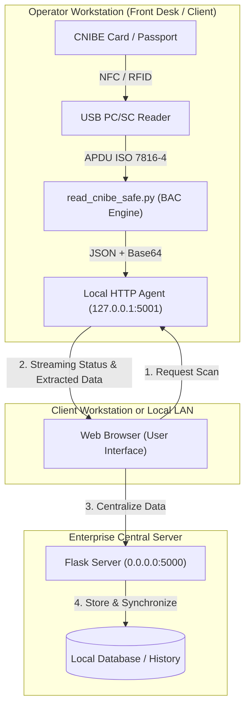

# CNIBE & Passport Reader — Modern Biometric eMRTD Reading System

<p align="center">
  
  
  
  
</p>

<p align="center">
  <strong>Comprehensive, modular, and highly secure software solution for contactless (NFC) reading of Biometric Electronic National Identity Cards (CNIBE, TD1 format) and Biometric Passports (TD3 format).</strong>
</p>

<p align="center">
  <a href="README.md"><strong>Français</strong></a> •
  <a href="README_EN.md"><strong>English</strong></a>
</p>

---

## 📌 Table of Contents

- [Overview](#-overview)
- [Technical Architecture](#-technical-architecture)
- [Standards & Decoded Data](#-standards--decoded-data)
- [Hardware & Compatibility](#-hardware--compatibility)
- [Repository Structure](#-repository-structure)
- [Installation & Quickstart Guide](#-installation--quickstart-guide)
  - [1. Standalone CLI Mode](#1-standalone-cli-mode)
  - [2. Client / Server Mode (Web Dashboard)](#2-client--server-mode-web-dashboard)
- [REST API Specifications](#-rest-api-specifications)
- [Security & Privacy](#-security--privacy)
- [Legal Notice & Compliance](#-legal-notice--compliance)
- [Enterprise Use Cases](#-enterprise-use-cases)
- [Troubleshooting & FAQ](#-troubleshooting--faq)
- [Author & Contact](#-author--contact)

---

## 📖 Overview

Modern electronic travel documents and national identity cards (**eMRTD** - *electronic Machine Readable Travel Documents*) embed a secure contactless RFID/NFC chip containing civil and biometric identity details.

Historically, reading these identity documents (specifically the **Algerian CNIBE**) relied on obsolete browsers and proprietary plug-ins (e.g., Firefox 52 ESR, legacy ActiveX controls), preventing seamless integration into modern enterprise infrastructures.

**CNIBE & Passport Reader** modernizes this entire workflow by providing:
- A **native Python PC/SC engine** implementing **BAC** (*Basic Access Control*) cryptographic authentication and ASN.1 parsing.
- A **decoupled Client / Server architecture**, enabling multiple operator front desks equipped with USB NFC readers to feed identity data into a central server.
- A **modern responsive web interface** (HTML5, Vanilla CSS, asynchronous JavaScript) rendering civil metadata, National Identification Number (NIN), biometric photograph, and digitized signature.
- A **lightweight local background agent** offering real-time progress streaming.

---

## 🏗 Technical Architecture

The project is structured around a resilient client-server network topology designed for enterprise LAN environments:



### Key Architectural Strengths:
1. **Zero proprietary drivers required on server side**: The Flask server can run seamlessly on Linux, Docker, or Windows Server without any attached physical NFC hardware.
2. **Lightweight operator workstations**: Only the lightweight local agent and standard USB PC/SC driver are needed on desk computers.
3. **Fault isolation**: Any card read disruption on a specific desk does not affect the central server or other operators.

---

## 🔐 Standards & Decoded Data

The engine strictly implements international specifications **ICAO Doc 9303 (Parts 1, 3, 9, 10, 11)**:

| Data Group (DG) | ICAO Standard Name | Extracted Content | Decoding & Formats |
|:---|:---|:---|:---|
| **EF.DG1** | Machine Readable Zone (MRZ) | Name, Surnames, Document No., Nationality, Sex, Dates (Birth, Expiry) | TD1 format (3 lines, CNIBE) and TD3 format (2 lines, Passport) |
| **EF.DG2** | Biometric Facial Image | Official biometric high-resolution portrait photograph | Tag ASN.1 `5F2E` / `7F60` extraction (standard JPEG or JPEG2000) |
| **EF.DG7** | Biometric Signature | Digitized handwritten signature of the cardholder | Tag ASN.1 `5F43` extraction (raster / JPEG image) |
| **EF.DG11** | Additional Personal Details | **NIN (18 digits)**, Full name in Arabic and Latin scripts, Place of birth, Sex & Blood type | UTF-8 and ISO/IEC 8859 bilingual decoding (Arabic / French) |
| **EF.DG12** | Additional Document Details | Issuing authority, Document issuance date | Bilingual textual ASN.1 parsing |
| **EF.COM** | Common Data | List of active Data Groups present on the contactless chip | Standard TLV directory |

### Cryptographic Security Engine (BAC)
1. **Session Key Derivation**: SHA-1 hashing of Document Number, Date of Birth, and Date of Expiry (along with their respective check digits) to compute `K_seed`.
2. **3DES Operations**: Symmetric derivation of encryption (`K_enc`) and message authentication (`K_mac`) session keys.
3. **Secure Messaging**: All APDU commands sent to read protected Data Groups are encrypted (3DES-CBC) with Retail-MAC integrity verification (ISO 9797-1 MAC Algorithm 3).

---

## 🧰 Hardware & Compatibility

The software interfaces with standard **PC/SC** (Personal Computer/Smart Card) subsystem through the Windows Smart Card service (`SCardSvr`) and `pyscard`.

### Verified NFC Readers:
- **ACS ACR122U** (USB Contactless Smart Card Reader)
- **Identiv uTrust 3700 F** / **4701 F**
- **HID OMNIKEY 5022** / **5422**
- Any **PC/SC CCID Contactless** compliant reader.

### Supported Documents:
- **Algerian CNIBE** (Biometric Electronic National Identity Card, TD1 format).
- **Algerian Biometric Passport** (and any ICAO Doc 9303 compliant TD3 passport).

---

## 📁 Repository Structure

```text
CNIBE-Reader/
├── LICENSE                             # MIT Open Source License
├── README.md                           # Documentation complète (Français)
├── README_EN.md                        # Complete Documentation (English)
│
├── local/                              # OPERATOR CLIENT WORKSTATION
│   ├── cnibe_agent.py                  # Local HTTP agent (listens on 127.0.0.1:5001)
│   ├── read_cnibe_safe.py              # Standalone ICAO BAC PC/SC cryptographic engine
│   ├── get_card_token.ps1              # Inter-process bridge script
│   ├── tokens_cache.example.json       # Cache template for local diagnostics
│   ├── requirements.txt                # Client dependencies (pyscard, pycryptodome)
│   ├── lancer_agent.bat                # 1-click launcher for client desk
│   └── README_CLIENT.md                # Operator setup guide
│
├── serveur/                            # CENTRAL ENTERPRISE WEB SERVER
│   ├── server_minimal.py               # Central Flask server (listens on 0.0.0.0:5000)
│   ├── templates/index.html            # Web dashboard (live visualizer, history, photo)
│   ├── requirements.txt                # Server dependencies (Flask, requests)
│   ├── lancer_serveur.bat              # 1-click launcher for central server
│   └── README_SERVEUR.md               # Server administrator guide
│
├── .dev/                               # DEVELOPER TOOLS & DIAGNOSTICS
│   ├── inspect_endpoints.py            # Endpoint enumeration and inspection
│   ├── inspect_live_ministere.py       # Diagnostic script (synthetic values)
│   ├── uid.py                          # Fast NFC card detection / ATR test
│   └── README.md                       # Diagnostic tools documentation
│
└── .gitignore                          # Strict exclusion of sensitive files and caches
```

---

## 🚀 Installation & Quickstart Guide

### Prerequisites
- **Operating System:** Windows 10 or Windows 11 (64-bit).
- **Python Runtime:** Python 3.10 or 3.11 with `pip` added to system PATH.
- **Windows Service:** *Smart Card* service (`SCardSvr`) must be active.

---

### 1. Standalone CLI Mode

For developers seeking to execute the NFC engine directly or integrate it into automated test pipelines:

```powershell
# Navigate to local module
cd local

# Install required dependencies
py -3.11 -m pip install -r requirements.txt

# 1. Run official ICAO Part 11 cryptographic test vectors
py -3.11 read_cnibe_safe.py --test-vectors

# 2. Perform live card reading (supplying document number, DOB, DOE)
py -3.11 read_cnibe_safe.py --doc "123456789" --dob "15/05/1985" --doe "20/12/2030" --photo "photo.jpg" --signature "signature.png"
```

---

### 2. Client / Server Mode (Web Dashboard)

Ideal for multi-desk or front-office enterprise deployments.

#### Step A: Launch Central Server
On the machine designated as the server (or locally on the same PC):
```powershell
cd serveur
py -3.11 -m pip install -r requirements.txt
# Launch server
py -3.11 server_minimal.py
# Or double-click 'lancer_serveur.bat'
```
*The server starts and listens on `http://0.0.0.0:5000`.*

#### Step B: Launch Local Agent on Operator Desk
On the machine with the USB NFC reader connected:
```powershell
cd local
py -3.11 -m pip install -r requirements.txt
# Launch agent
py -3.11 cnibe_agent.py
# Or double-click 'lancer_agent.bat'
```
*The agent starts and listens on `http://127.0.0.1:5001`.*

#### Step C: Usage through Web Browser
1. Open your browser and navigate to `http://127.0.0.1:5000` (or the server's LAN IP address, e.g. `http://192.168.1.100:5000`).
2. Place the CNIBE card or passport firmly on the NFC reader antenna.
3. Enter the MRZ key parameters (or use the prefill feature) and click **Lire la Carte (NFC)**.
4. Decoded civil details, National ID Number (NIN), photo, and signature render dynamically on screen and record into server history.

---

## 📡 REST API Specifications

### Local Agent (`http://127.0.0.1:5001`)

- **`GET /status`**
  - Verifies local agent responsiveness and PC/SC reader presence.
  - *Response:* `{"status": "ONLINE", "reader_connected": true, "version": "1.0.0"}`

- **`POST /scan`**
  - Triggers BAC session authentication and Data Groups extraction.
  - *Body (JSON):*
    ```json
    {
      "doc": "123456789",
      "dob": "15/05/1985",
      "doe": "20/12/2030",
      "wait": 15
    }
    ```
  - *Response:* Full civil dataset, Base64-encoded portrait image, and signature.

---

### Central Server (`http://0.0.0.0:5000`)

- **`GET /api/history`**
  - Retrieves chronological history of processed identity cards.
- **`POST /api/save_card`**
  - Persists and archives scanned identity records on the server.

---

## 🔒 Security & Privacy

Data privacy and system integrity are foundational to this project:

1. **Zero Sensitive Data Stored in VCS**:
   - `.gitignore` rigorously prevents accidental commits of identity photos, signatures, logs, or local token caches.
   - All unit test vectors bundled with the codebase are 100% synthetic.
2. **Exclusive PC/SC Transaction Locking (`SCardBeginTransaction`)**:
   - Prevents background Windows subsystems (such as Windows Hello or Certificate Propagation) from preempting APDU exchanges during critical BAC sequences.
3. **Passive Safety Guard**:
   - The engine operates strictly in **passive read-only mode**. No write, erase, or state-altering APDU commands are ever dispatched to the card.
4. **Volatile In-Memory Session Keys**:
   - `K_enc` and `K_mac` keys reside solely in memory and are discarded immediately when the card is released.

---

## ⚖️ Legal Notice & Compliance

> [!IMPORTANT]
> **This software is engineered exclusively for lawful, authorized, and compliant operations.**
>
> 1. **Data Protection Compliance (Law No. 18-07):** Usage within Algeria must strictly adhere to **Law No. 18-07 of June 10, 2018**, regarding the protection of individuals with respect to the processing of personal data.
> 2. **Explicit Consent:** Reading identity cards or passports must only be performed on **your own identity documents** or with the **explicit, documented consent of the cardholder**.
> 3. **Disclaimer:** The author disclaims any liability for misuse, unauthorized extraction, or unlawful application of this software.

---

## 💼 Enterprise Use Cases

- **Healthcare & Hospital Networks:** Instant error-free retrieval of the **NIN** and civil status during patient intake.
- **Banking, Fintech & Insurance (KYC):** Seamless customer onboarding and automated identity verification.
- **Hospitality & Travel:** Rapid 2-second guest check-in with portrait photo archival.
- **Legal & Notary Practices:** Certified formal identification of signing parties.

---

## ❓ Troubleshooting & FAQ

<details>
<summary><strong>1. Error: "No PC/SC reader detected"</strong></summary>
Ensure your USB reader is securely plugged in. In Windows Device Manager, verify that the CCID Smart Card Reader driver is installed properly and that the Windows <em>Smart Card</em> service is running (command: <code>net start SCardSvr</code>).
</details>

<details>
<summary><strong>2. APDU Error: <code>69 82</code> during BAC authentication</strong></summary>
Status word <code>69 82</code> (Security status not satisfied) indicates mismatched BAC derivation keys. Check the accuracy of the Document Number, Date of Birth, and Date of Expiry entered.
</details>

<details>
<summary><strong>3. Intermittent NFC connection drop during reading</strong></summary>
Contactless eMRTD chips require continuous RF power. Ensure the card remains completely flat and still over the NFC reader target until the scan progress completes (typically 2 to 4 seconds).
</details>

---

## 👤 Author & Contact

**Youcef Badjadi (bjyoucef)**
- **GitHub:** [@bjyoucef](https://github.com/bjyoucef)
- **Repository:** [https://github.com/bjyoucef/CNIBE-Reader](https://github.com/bjyoucef/CNIBE-Reader)

---

<p align="center">
  <sub>Engineered with precision for smart card architectures and open biometric standards.</sub>
</p>
